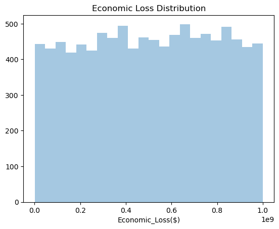
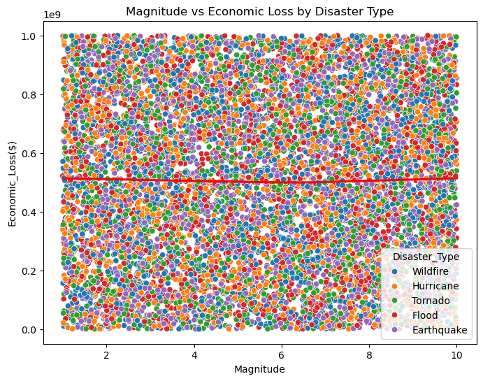
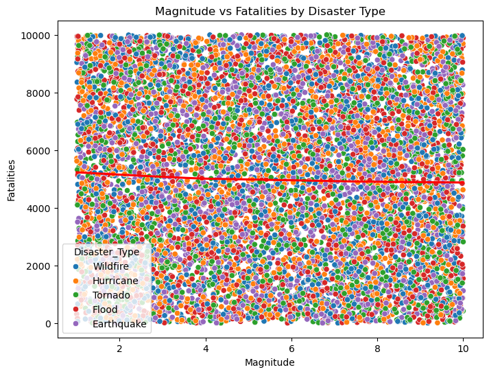
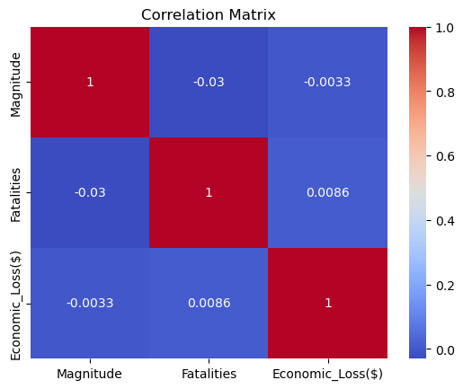
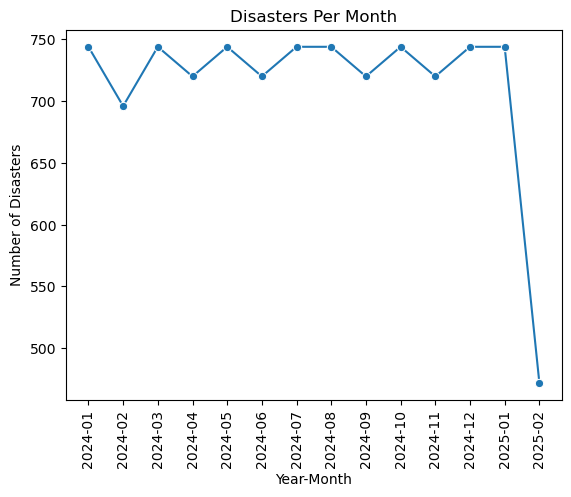
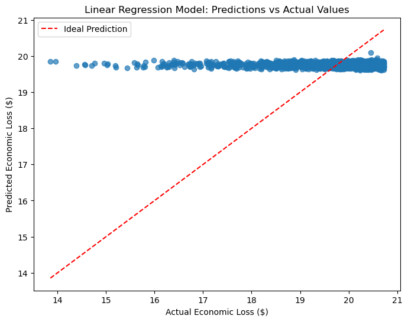
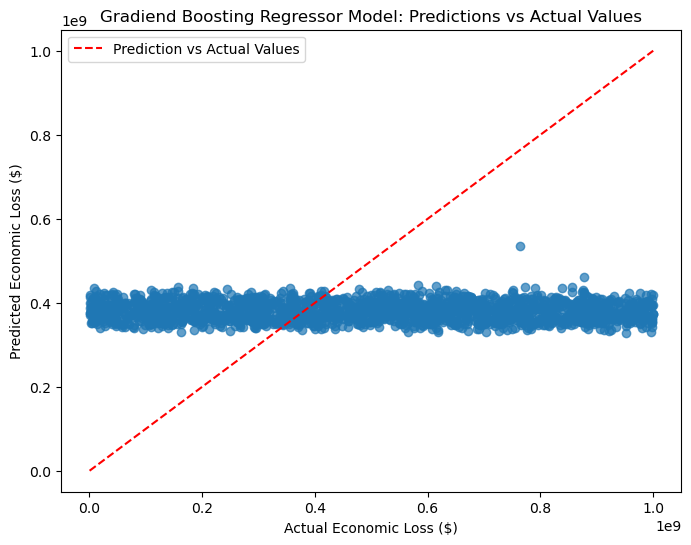
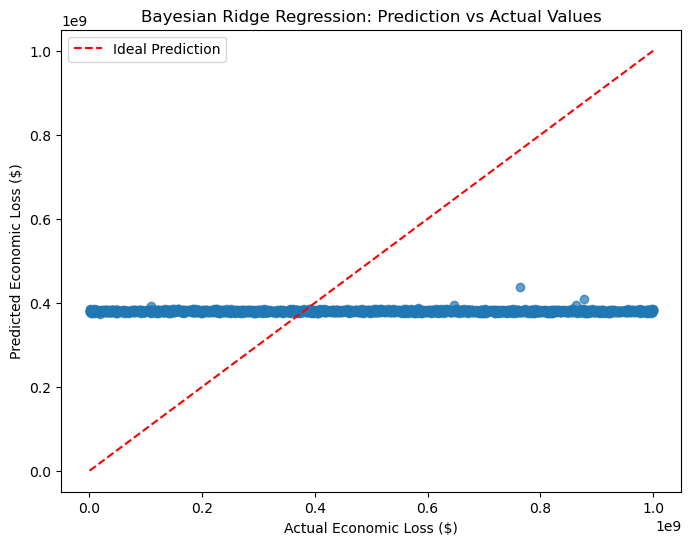
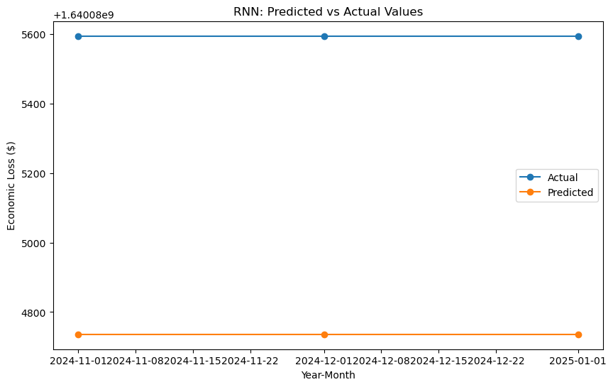

# Data Analysis and Forecasting of Natural Disasters

This project performs Exploratory Data Analysis (EDA) as well as train and implement 4 machine learning models that could predict future natural disasters based on a synthetic data. It is the work of Maddy Lok, Genki Hirayama, Brian Duckworth and Hamdi Kucukengin.

## Table of Contents
- [Introduction](#introduction)
- [Features](#features)
- [Data Description](#data-description)
- [Exploratory Data Analysis](#exploratory-data-analysis)
- [Feature Engineering](#feature-engineering)
- [Model Implementation](#model-implementation)
- [Results,Observations and Conclusions](#results-observations-and-conclusions)
- [Summary and Suggestions](#summary-and-suggestions)

## Introduction

Our projects aim is to showcase what we have learned over the duration of our course. This includes performing EDA on the selected data, data preparation and feature engineering, training and implementing machine learning models, and presenting our findings in the form of visuals and recommendations. A more detailed explanation could be found in our [project description file](Final_Project_Description.docx). For this project, we used the dataset from ["Forecasting Disaster Management in 2024"](https://www.kaggle.com/datasets/umeradnaan/prediction-of-disaster-management-in-2024/data).

## Features

- Includes the [description file](Final_Project_Description.docx) with an Executive Summary, Problem Statement, Research Objectives, a written explanation of our EDA and a written explanation of our Data Preparation and Feature Engineering.
- Performs EDA on the dataset, providing clear visuals.
- Performs Data Preparation and Feature Engineering.
- Trains and implements (insert model names here) models.
- Evaluates the models performance using (insert evaluation metrics here).

## Data Description

- **Disaster_ID:** A special number assigned to every calamity.
- **Disaster_Type:** Category (e.g., Flood, Fire, Earthquake).
- **Location:** The nation where the catastrphe happened.
- **Magnitude:** The disaster's intensity (scale of 1.0 to 10.0).
- **Date:** The event's timestamp.
- **Fatalities:** The total number of people killed by the calamity.
- **Economic_Loss($):** Damage to finances expressed in US dollars.

## Exploratory Data Analysis

Going into our EDA, it is important to note that the dataset we work with is synthetically generated. The data does not represent real-life catastrophes and the features might not follow a trend.

### Check for missing values in the dataset.

```
Disaster_Type       0
Location            0
Magnitude           0
Date                0
Fatalities          0
Economic_Loss($)    0
dtype: int64
```

Checking for the missing values, we see that there are no missing values for any of the features. This means that we don't have to worry about missing value handling.

### Check unique values for the categorical features.

```
Disaster_Type: 5 unique values
Location: 6 unique values
Date: 10000 unique values
```

In order to better understand these categorical features, we can look into what these unique values are. Printing all of the `.unique()` values for Disaster_Type and Location returns the following categories:

- Disaster_Type:
```
Wildfire
Hurricane
Tornado
Flood
Earthquake
```

- Location
```
Brazil
Indonesia
China
India
USA
Japan
```

Since the Date feature has 10000 unique values, we can invastigate some of the values through our `disaster.head()` and find out that Date values change at an hourly rate starting from 01/01/2024.

### Investigate the distribution of the target variable

For our project, we wanted to see how our features would change the economic loss of the respective countries, and decided to choose that feature as our target.

First, we wanted to look at the density distribution of our target variable:



As we can see, the distribution of the target variable does not follow a normal distribution, or any trend for that matter. It seems to be randomly distributed.

Next, we generate a scatterplot to investigate a potential connection between the magnitude of the disaster and our target variable, and compare the results based on the type of the disaster:



Similar to our previous observations, we can see that the economic loss does not seem to be affected by the magnitude or the type of the disaster.

### Investigate correlation between features

We wanted to look into potential correlations between our features. For this, we generated a scatterplot between the disaster magnitude and number of fatalities, based on the type of the disaster:



Once again, the scatter plot does not show any clear correlation between the magnitude of the disaster and the number of casualties.

To take a more general approach into finding correlations between features and the target variable, we generated a correlation matrix using the quantitative features:



The correlation matrix does not show any significant correlation between different features.

### Time series analysis

One other data exploration we performed was on the number of disasters per month. This was in order to catch any potential seasonal trends.



While the time series shows a drastic decline for Feb-2025, this is likely due to the synthetic data generation process that resulted in the hourly disaster generation not lasting until the end of the month of February. We recommend the removal of these data points for the sake of avoiding unintentional skewing of the dataset.

## Feature Engineering

For feature engineering, we created two new features. One newly generated feature is "Loss Per Fatality", which is generated by dividing the economic loss by the number of fatalities. We believe that this feature would better represent any potential correlation between economic loss and the loss of human lives.

Second feature we generated is the log of the economic loss. We hoped that investigating this value could better show any variations in the economic loss while handling the outliers that could potentially skew the data.

In addition to the two features we generated, we have also encoded the categorical data. This would assign numbers to disaster type and location features, allowing us to better investigate these features and any correlation to the target variable.

## Model Implementation

For this project, we have decided to implement 4 ML models. Here, I will briefly explain the models implemented and the reason behind choosing these models.

We performed some preprocessing of the dataset before moving on to the model training and fitting. This is to better utilize the numerical and categorical features.

### Linear Regression Model

We wanted to start with Linear Regression to set up a baseline. This is a simple model trained and fitted on the preprocessed dataset that has been split into train and test sets as follows:

```python
# Initialize and fit the model
linear_model = LinearRegression()
linear_model.fit(X_train_transformed, y_train)

# Make the predictions on the test set
y_pred = linear_model.predict(X_test_transformed)
```

### Gradient Boosting Regressor Model

The second model we implement is Gradient Boosting Regressor. We chose this model for it's predictive accuracy and ability to capture complex relationships in the dataset.

```python
# Initialize Gradient Boosting Regressor
gbm = GradientBoostingRegressor(n_estimators = 500,
                                learning_rate = 0.05,
                                max_depth = 5,
                                random_state = 42)
# Fit the model
gbm.fit(X_train_transformed, y_train)

# Predict on the test set
y_pred_log = gbm.predict(X_test_transformed)

# Reverse the log transformation
y_pred_rev_log = np.expm1(y_pred)
```

### Bayesian Ridge Regressor Model

As our third model, we decided to use the Bayesian Ridge Regressor model, which has a built-in regularization to reduce issues related to overfitting.

```python
# Initialize Bayesian Ridge Regressor
bayesian_ridge = BayesianRidge()

# Fit the model on the training data
bayesian_ridge.fit(X_train_transformed, y_train)

# Predict on the test set
y_pred = bayesian_ridge.predict(X_test_transformed)

# Reverse the log transformation
y_pred_rev_log = np.expm1(y_pred)
```

### Recurrent Neural Network

We wanted to use create an RNN to use the `Date` column of our dataset to make our predictions, as RNN are good at handling temporal patterns.

- For this model, we first processed the date data and converted it from `Period`data type to `timestamp` data type.

```python
# Process the date data
disaster['Year-Month'] = disaster['Year-Month'].dt.to_timestamp()
disaster = disaster.sort_values('Year-Month')
```

- We then grouped our features by the `Year-Month` and calculated the average of features such as Magnitude and Loss per Fatality.

```python
# Group the data by Year-Month
monthly_data = disaster.groupby('Year-Month').agg({
    'Economic_Loss($)': 'mean',
    'Magnitude': 'mean',
    'Loss_Per_Fatality': 'mean'
}).reset_index()
```

- Next, we did some processing such as feature scaling and reshaping the data for the RNN, as well as train-test split.

```python
# Feature scaling
scaler_X = MinMaxScaler()
scaler_y = MinMaxScaler()

X_scaled = scaler_X.fit_transform(X)
y_scaled = scaler_y.fit_transform(y.reshape(-1, 1))

# Reshape the data for RNN
timesteps = 3
X_rnn, y_rnn = [], []

for i in range(len(X_scaled) - timesteps):
    X_rnn.append(X_scaled[i : i + timesteps])
    y_rnn.append(y_scaled[i + timesteps])
    
X_rnn = np.array(X_rnn)
y_rnn = np.array(y_rnn)

# Train-test split
split_index = int(0.8 * len(X_rnn))
X_train, X_test = X_rnn[:split_index], X_rnn[split_index:]
y_train, y_test = y_rnn[:split_index], y_rnn[split_index:]
```

- Now that we have our data ready, we can create our RNN model. The model includes an Long Short-Term Memory (LSTM) layer with 64 hidden units and a Rectified Linear Unit (ReLU) activation, followed by a dropout layer to reduce overfitting. We then have another LSTM layer with 32 hidden units and the same activation function, and one more dropout layer. Finally, we have the dense layer for the prediction output.

```python
# Create the RNN model
rnn_model = Sequential([
    LSTM(64, activation = 'relu', input_shape = (timesteps, len(features)), return_sequences = True),
    Dropout(0.2),
    LSTM(32, activation = 'relu'),
    Dropout(0.2),
    Dense(1)
])
```

- Last part of our code compiles the model we created, trains the model on the split features and target designated for the training, and makes the predictions on the test dataset. The code then reverses the MinMaxScaler on the predicted test values for model evaluation.

```python
# Compile the model
rnn_model.compile(optimizer = 'adam', loss = 'mse', metrics = ['mse'])

# Model training
rnn_model.fit(X_train, y_train, epochs = 50, batch_size = 8, validation_split = 0.2, verbose = 1)

# Model Predictions on the test set
y_pred_scaled = rnn_model.predict(X_test)

# Reverse the MinMaxScaler on actual and predicted test values
y_pred = scaler_y.inverse_transform(y_pred_scaled)
y_test_actual = scaler_y.inverse_transform(y_test)
```

## Results, Observations and Conclusions

Following are the results returned from evaluations of each of the models:

| Model                          | Mean Squared Error (MSE) | R-squared Score |
|--------------------------------|--------------------------|-----------------|
| Linear Regression              | 9.83 x 10^16             | -0.17           |
| Gradient Boosting Regressor    | 9.83 x 10^16             | -0.17           |
| Bayesian Ridge Regressor       | 9.73 x 10^16             | -0.16           |
| Recurrent Neural Network (RNN) | 7.31 x 10^13             | -3.06           |

### Linear Regression Model



Looking at the Predictions vs Actual Values plot, as well as the table of MSE and R-squared score, we can see that the Linear Regression Model was not able to make accurate predictions. The extremely high MSE score suggests that the target variable has a very wide range of values, this can also be supported by the density distribution plot in our EDA. Additionally, both the high MSE and the negative R-squared scores indicate that the model was fitting poorly to the dataset and was not able to learn from the features.

### Gradient Boosting Regressor



The results for both the Linear Regression Model and the Gradient Boosting Regressor are the exact same. This could suggest that there could be data related issues, such as lack of features or high noise.

### Bayesian Ridge Regressor



Although the scores for this model are slightly better, the MSE is still very high and we still have a negative R-squared score, which means that our model performs worse than a simple baseline model that would predict the mean of the target variable.

### Recurrent Neural Network (RNN)



Compared to the other 3 models, the RNN has performed much better, considering the MSE is drastically lower than the MSE of the other models. This could be due to the models ability to capture temporal relationships. However, the MSE for the RNN is still significantly large and we still got a negative R-squared score, meaning that the model was not fitting to our dataset overall.

Looking at all four of our models, we can see a trend in terms of the predictive powers on the dataset. It seems like none of the models we implemented was able to make accurate predictions in our cross-validations. Especially the consistently negative R-squared scores mean that the models are either underfitting or overfitting. This could be due to the low number of features that our dataset has, or it could be related to the randomness of our data. If our dataset is fully random, where the target variable has a uniform distribution and our EDA shows no clear correlation between the features and the target variable, it could mean that there simple is no correlation and none of the features alone or combined has an impact on the change in the target variable. This randomness of the dataset is partially due to the synthetic nature of the dataset. Compared to real-life disasters, where predictors such as magnitude, location and type of the disaster could have an impact on the economic loss, this dataset likely did not take into account these relationships in generating the datapoints.

## Summary and Suggestions

This projects has examined a dataset consisted of information on synthetically generated data on variety of disasters across 6 different countries. The projects analysis is contains Exploratory Data Analysis, Feature Engineering, preprocessing and finally the implementation of four machine learning models. The project also includes model evaluation for all 4 models in the form of Mean Squared Errors (MSE) and R-squared scores.

All four models evaluations returned poor performance results, suggesting potential issues with the data quality. The potential causes are insufficient features that also don't correlate to the target variable, likely due to the random nature of the dataset.

If the client still prefers synthetic data, it is important to generate a dataset that initially captures the complex relationships between the features and the target variable before training predictive models. Our suggestion to the client/management would be to spend more resources on higher quality data collection from real-life events rather than generating synthetic datasets. Especially in cases such as international disaster related data, there are already resources available such as [The Geocoded Disasters Dataset (GDIS)](https://cmr.earthdata.nasa.gov/search/concepts/C2022273992-SEDAC.html), which has extensive data on variety of disasters, similar to the dataset this project has analyzed.